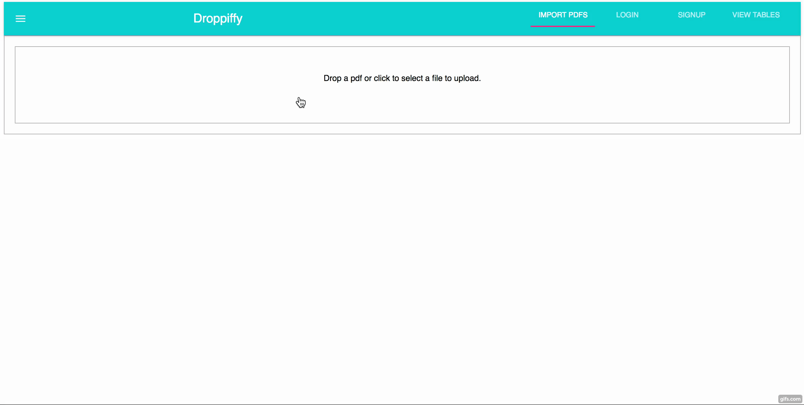

## Droppify
Take a PDF table and turn it into an interactive searchable web app. 

Team
Albert Kao, Jonathan Tom, Max Braz

npm pdf-table-extractor - https://www.npmjs.com/package/pdf-table-extractor
material UI - http://www.material-ui.com/#/

This app solves a problem that nurses and acupuncturists have when finding which
classes to take for their continuing education classes. They are given a PDF table
of 913 possible classes to take across the US. Our app eases the search by filtering 
keywords the user searches for. 